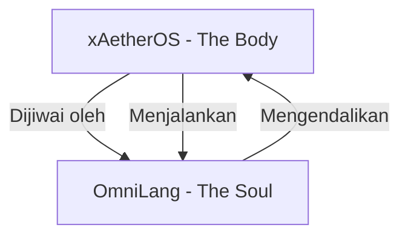

Bismillahirrahmanirrahim.
Dengan menyebut nama Allah Yang Maha Pemurah lagi Maha Penyayang.

Architect: Herman Krisnanto,

# OmniLang: The Universal Programming Language for the xAetherOS Fabric

**White Paper v2.3 & Master Roadmap**  
**Last Updated**: 03 Maret 2026 (v2.3.0 - Supreme Stability Release)  
**Status**: Production Ready / Distributed Intelligence Fabric  
**Repo**: [https://github.com/HaKaTo99/OmniLang.git](https://github.com/HaKaTo99/OmniLang.git)

---

## 📋 Daftar Isi

1. [Ringkasan Eksekutif](#ringkasan-eksekutif)
2. [Latar Belakang & Visi](#latar-belakang--visi)
3. [Masalah yang Dipecahkan](#masalah-yang-dipecahkan)
4. [Filosofi Desain OmniLang](#filosofi-desain-omnilang)
5. [Arsitektur & Komponen Utama](#arsitektur--komponen-utama)
6. [Integrasi dengan xAetherOS](#integrasi-dengan-xaetheros)
7. [Fitur Bahasa](#fitur-bahasa)
8. [Roadmap Pengembangan & Strategi Adopsi](#omnilang-hakato99-roadmap-pengembangan-dan-strategi-adopsi-)
9. [Ekosistem & Tooling](#ekosistem--tooling)
10. [Multi-Interface Universal Access](#multi-interface-universal-access)

---

## 💎 Milestone Terkini: Actuator Hardware Node (v2.2.0)
**Status**: Diaktifkan (02 Maret 2026)

Proyek OmniLang telah mencapai titik **Distributed Intelligence Fabric** yang menyentuh dunia fisik. Kami telah membuktikan bahwa satu bahasa dapat menangani **AI (Neural Networks)** lintas jaringan mesh secara aman dengan *Capability Tokens*, serta mengeksekusi intervensi sirkuit fisik (motor/LED) melaui Node Aktuator Serial HUI.

> **"Satu Bahasa untuk Memerintah Semuanya."**

---

## Ringkasan Eksekutif

**OmniLang** adalah bahasa pemrograman universal yang dirancang khusus untuk ekosistem **xAetherOS**—Secure Distributed Intelligence Fabric. Lebih dari sekadar bahasa pemrograman biasa, OmniLang bertujuan menjadi **lapisan abstraksi universal** yang memungkinkan pengembang menulis kode sekali dan menjalankannya di berbagai target runtime: dari kernel xAetherOS, WebAssembly, hingga neural signals untuk BCI (Brain-Computer Interface).

Dengan OmniLang, fragmentasi bahasa pemrograman dan platform tidak lagi menjadi penghalang. Pengembang cukup mempelajari satu bahasa untuk mengakses seluruh kekuatan fabric xAetherOS, termasuk:
- **Quantum Bus** untuk komunikasi terdistribusi yang aman.
- **Oracle Engine** untuk orkestrasi AI-agentic di tingkat kernel.
- **Capability-based security** dengan post-quantum cryptography.
- **Distributed mesh** dengan ability trading dan task migration otomatis.

OmniLang bukan sekadar proyek bahasa—ia adalah **jiwa dari xAetherOS**, yang akan mengubah cara manusia dan mesin berinteraksi di era komputasi terdistribusi.

---

## Latar Belakang & Visi

xAetherOS telah mencapai **Singularity Release (v5.0)** dengan fondasi kokoh: kernel stabil, multi-platform, distributed mesh, AI-native, dan post-quantum security. Namun, untuk benar-benar mewujudkan visi sebagai **Secure Distributed Intelligence Fabric**, xAetherOS membutuhkan bahasa pemrograman yang:
- Lahir dari dan untuk arsitektur unik xAetherOS.
- Mampu mengekspresikan konsep distributed computing, AI orchestration, dan zero-trust security secara alami.
- Menjembatani fragmentasi ekosistem yang ada (Linux, Android, Windows, Web).

**Visi OmniLang**: Menjadi bahasa universal yang menyatukan semua paradigma pemrograman dan semua platform di atas fabric xAetherOS, sehingga pengembang cukup menulis sekali dan aplikasi mereka dapat berjalan di mana saja—dari perangkat IoT dengan RAM 256KB hingga superkomputer dengan akselerator quantum.

---

## Masalah yang Dipecahkan

| Masalah | Solusi OmniLang |
|---------|-----------------|
| Fragmentasi bahasa dan platform | Kompilasi multi-target (Rust, WASM, Java bytecode, neural signals) |
| Kesulitan mengakses fitur distributed fabric | Sintaksis native untuk Quantum Bus, Oracle Engine, capability market |
| Keamanan sebagai "tambahan" | Keamanan sebagai first-class citizen (capability-based, PQC default) |
| Learning curve tinggi untuk distributed computing | Abstraksi tingkat tinggi dengan performa tingkat rendah |
| Ketergantungan pada ekosistem bahasa lain | Interoperabilitas mulus melalui FFI dan transpilasi |

---

## Filosofi Desain OmniLang

1. **Universal, Bukan Sekadar Baru**  
   OmniLang tidak bertujuan menggantikan bahasa lain, tetapi menyatukannya. Ia adalah "lingua franca" untuk fabric xAetherOS.

2. **Keamanan sebagai Inti (Zero-Trust by Default)**  
   Setiap operasi memerlukan capability token. Enkripsi end-to-end dan post-quantum cryptography adalah default.

3. **Distributed-First**  
   Bahasa ini lahir untuk mesh. Konsep seperti `@mesh`, `@oracle`, `@quantum`, dan `@hardware` adalah warga kelas satu, bukan pustaka tambahan.

4. **Ekspresif namun Efisien**  
   Menggabungkan kemudahan Python, kecepatan Rust, dan kejelasan Go, dengan kontrol tingkat rendah saat diperlukan.

5. **Masa Depan-Siap (Future-Proof)**  
   Dirancang untuk mengakomodasi teknologi masa depan: BCI, quantum computing, neuromorphic hardware.

---

## Arsitektur & Komponen Utama

```
┌─────────────────────────────────────────────┐
│             OmniLang Source Code             │
└─────────────────────────────────────────────┘
                      │
                      ▼
┌─────────────────────────────────────────────┐
│               Frontend Compiler              │
│  ┌──────────┐  ┌──────────┐  ┌──────────┐  │
│  │  Lexer   │→│  Parser  │→│   AST    │  │
│  └──────────┘  └──────────┘  └──────────┘  │
└─────────────────────────────────────────────┘
                      │
                      ▼
┌─────────────────────────────────────────────┐
│         Intermediate Representation          │
│           (OmniIR - Platform Agnostic)       │
└─────────────────────────────────────────────┘
                      │
                      ▼
┌─────────────────────────────────────────────────────────────────────────────┐
│                       Backend Code Generators                               │
│  ┌──────────┐ ┌──────────┐ ┌──────────┐ ┌──────────┐ ┌──────────┐ ┌───────┐ │
│  │ Rust     │ │ WASM     │ │ JVM      │ │ C/C++    │ │ SQL/DB   │ │Neural │ │
│  │ (Perf)   │ │ (Web)    │ │ (Android)│ │ (Legacy) │ │ (Data)   │ │(BCI)  │ │
│  └──────────┘ └──────────┘ └──────────┘ └──────────┘ └──────────┘ └───────┘ │
└─────────────────────────────────────────────────────────────────────────────┘
                      │
                      ▼
┌─────────────────────────────────────────────┐
│         Target Runtime (xAetherOS)           │
│  Kernel │ WASM Runtime │ ART │ BCI Driver   │
└─────────────────────────────────────────────┘
```

### Komponen Utama:

1. **Frontend Compiler**: Lexer + Parser yang menghasilkan Abstract Syntax Tree (AST).
2. **OmniIR**: Intermediate Representation yang agnostik terhadap platform target.
3. **Backend Codegens**: Modul untuk menghasilkan kode native di berbagai target.
4. **Runtime Library**: Pustaka standar yang mengakses fitur xAetherOS.
5. **Tooling**: LSP, debugger, profiler, package manager.

---

## Integrasi dengan xAetherOS

OmniLang terintegrasi secara mendalam dengan tiga pilar inti xAetherOS:

### 1. AI-Native Distributed Kernel (Oracle Engine)
```omnilang
// Prediktif migrasi task berdasarkan beban sistem
@oracle(predictive)
task computeHeavy(data: Matrix) -> Result {
    // Oracle Engine secara otomatis menempatkan task ini
    // di node dengan resource terbaik
    return process(data);
}
```

### 2. Post-Quantum Zero-Trust Security
```omnilang
// Capability-based access control
@capability(read, write)
accessFile(path: String) -> File {
    // Compiler otomatis menyisipkan verifikasi capability
    // dan enkripsi post-quantum
}

@pqc(algorithm: "kyber-1024")
secureChannel(peer: Device) -> Channel {
    // Quantum Bus dengan post-quantum cryptography
}
```

### 3. Self-Healing Global Mesh Fabric
```omnilang
@mesh(distributed)
computeAcrossMesh(data: Tensor) -> Tensor {
    // Task otomatis terdistribusi ke seluruh mesh
    // Self-healing jika node gagal
    
    @ability(type: "gpu", duration: "1h")
    useGPU() {
        // Sewa GPU dari node lain via ability marketplace
    }
}
```

---

## Fitur Bahasa

### 1. **Sintaksis Modern & Bersih**
```omnilang
// Mirip Go + Rust + Python
fn fibonacci(n: int) -> int {
    if n <= 1 {
        return n;
    }
    return fibonacci(n-1) + fibonacci(n-2);
}

// Type inference
let message = "Hello, Mesh!";  // string
let count = 42;                 // int
```

### 2. **Concurrency dengan Goroutine-like + Mesh Integration**
```omnilang
// Menjalankan task di seluruh mesh
@mesh
fn processImage(img: Image) -> Image {
    // Task ini akan didistribusikan ke node dengan GPU terbaik
}

// Channel terdistribusi via Quantum Bus
let ch = make(chan Result, size=100);
go processData(input, ch);
let result = <-ch;  // Menerima dari channel
```

### 3. **Ekspansi Aktuator Perangkat Keras (HUI)**
```omnilang
// Menyambungkan deklarasi fungsi ke port Serial Fisik
@hardware(port: "COM3", baud_rate: "115200")
fn trigger_alarm(severity: i32) -> bool;
```

---

# OmniLang HaKaTo99: Roadmap Pengembangan dan Strategi Adopsi 🚀

**Versi**: 2.2.0 (Maret 2026)  
**Status**: Production Ready – Distributed Intelligence Fabric  
**Repositori**: [github.com/HaKaTo99/OmniLang](https://github.com/HaKaTo99/OmniLang)

---

## 🗺️ Peta Jalan Menuju Universalitas

OmniLang dirancang sebagai bahasa pemrograman universal untuk ekosistem **xAetherOS**. Roadmap ini mencerminkan perjalanan dari fondasi bahasa hingga menjadi **sistem saraf terdistribusi** yang menyentuh dunia fisik, dan terus berkembang menuju komputasi masa depan.

---

## 📅 **Era I: Foundation (Maret – Desember 2025)**  
*Membangun fondasi bahasa, parser, dan ekosistem dasar.*

| Fase | Versi | Nama | Tanggal | Status |
|------|-------|------|---------|--------|
| 1 | v0.1 | Spesifikasi & Desain Bahasa | Mar 2025 | ✅ Selesai |
| 2 | v0.2 | Lexer & Parser Engine | Apr 2025 | ✅ Selesai |
| 3 | v0.3 | AST & Semantic Analysis | Mei 2025 | ✅ Selesai |
| 4 | v0.4 | OmniIR (Intermediate Representation) | Jun 2025 | ✅ Selesai |
| 5 | v0.5 | Backend Rust Codegen | Agu 2025 | ✅ Selesai |
| 6 | v0.8 | Standard Library (Runtime) | Nov 2025 | ✅ Selesai |
| 7 | v1.0 | Rilis Stabil Pertama | Des 2025 | ✅ Selesai |

**Pencapaian Utama**: Parser stabil, AST, OmniIR, codegen Rust, stdlib dasar.

---

## 📅 **Era II: Singularity & Universal Access (Jan – Feb 2026)**  
*Integrasi 12 antarmuka universal dan fitur bahasa tingkat lanjut.*

| Fase | Versi | Nama | Tanggal | Status |
|------|-------|------|---------|--------|
| 8 | v1.1 | Multi‑Interface Universal Access | Jan 2026 | ✅ Selesai |
| 9 | v1.2 | Harmonious Era (HOF, Pattern Matching) | Feb 2026 | ✅ Selesai |
| 10 | v1.2 | IDE Experience (TUI/Workstation) | Feb 2026 | ✅ Selesai |
| 11 | v1.2 | Harmonisasi & Audit Dokumentasi | Feb 2026 | ✅ Selesai |

**Pencapaian Utama**: 12 kanal antarmuka, higher‑order functions, TUI, dokumentasi terpadu.

---

## 📅 **Era III: Military Grade & Distributed Fabric (Feb 2026 – sekarang)**  
*AI, keamanan zero‑trust, distribusi mesh, dan koneksi hardware.*

| Fase | Versi | Nama | Tanggal | Status |
|------|-------|------|---------|--------|
| 12 | v1.2.2 | Security & Stability Hardening | Feb 2026 | ✅ Selesai |
| 13 | v1.5.0 | Advanced Intelligence (AI) – ONNX `@oracle` | Feb 2026 | ✅ Selesai |
| 14 | v1.6.0 | Future Tech (Blockchain/Quantum) | Feb 2026 | ✅ Selesai |
| 15 | v2.0.0 | The Grand Unification | Feb 2026 | ✅ Selesai |
| 16 | v2.1.0 | Distributed Intelligence Fabric (`@mesh` + X‑Capability) | Mar 2026 | ✅ Selesai |
| 17 | v2.2.0 | Actuator Hardware Node (HUI Expansion) | Mar 2026 | ✅ Selesai |
| 17.5 | v2.2.1 | Ekosistem WebAssembly (WASM) & Peluncur Mandiri (*Standalone*) | Mar 2026 | ✅ Selesai |

**Pencapaian Utama**: ONNX native, RPC mesh, keamanan token, kontrol hardware via UART, OODA loop end‑to‑end.

---

## 🚀 **Rencana ke Depan (2026 – 2028+)**

## 📱 **Dukungan OmniLang di Berbagai Platform**

| Platform | Status Saat Ini | Cara Instalasi / Penggunaan | Target Penyelesaian |
|:---------|:----------------|:-----------------------------|:--------------------|
| **Windows OS** | ✅ **Production Ready** | • Binary standalone (`omnilang.exe`) <br> • Build dari source dengan Rust toolchain <br> • WASM Playground | ✅ **Selesai** (v2.2.1) |
| **Linux OS** | ✅ **Production Ready** | • Binary standalone (`omnilang`) <br> • Package manager (`.deb`/`.rpm` via `opm` nanti) <br> • Build dari source | ✅ **Selesai** (v2.2.1) |
| **macOS** | ✅ **Production Ready** | • Binary standalone (`omnilang`) <br> • Homebrew tap (rencana) <br> • Build dari source | ✅ **Selesai** (v2.2.1) |
| **Web OS** (Browser) | ✅ **Production Ready** | • **WASM Playground** (live di browser) <br> • Integrasi website via JavaScript bindings | ✅ **Selesai** (v2.2.1) |
| **Android** | ✅ **Production Ready** | • **Android SDK (Gradle)** via `omnilang-sdk` <br> • **JVM/ART Bridge** (JNI FFI Bindings ke C-Dynamic Rust) <br> • Aplikasi Android *native backend* OmniLang | ✅ **Selesai** (v2.3.0) |
| **HarmonyOS** | 🔬 **Riset & Eksplorasi** | • Kompatibel **JVM/ART Bridge** (HarmonyOS Next mendukung AOSP) <br> • Integrasi via ArkCompiler | **Q4 2026** (v2.3.5) |

---

### 🔥 **Jangka Pendek (Q2 – Q4 2026): Ekspansi Platform Mobile & Ekosistem**

| Fase | Versi | Target | Platform | Estimasi | Status |
|------|-------|--------|----------|----------|--------|
| 18 | v2.2.1 | **WASM Backend & Standalone** | Web/PC | Mar 2026 | ✅ Selesai |
| 19 | v2.3.0 | **Android SDK & JVM Bridge (Supreme Stability)** | Android (JVM) | April 2026 | ✅ Selesai |
| **19.5**| **v2.3.5-alpha** | **HarmonyOS Native Bridge (C-ABI + NAPI)**| HarmonyOS | **Mei 2026** | ✅ Prototipe C-ABI|
| 20 | v2.3.0 | **Transpilasi JVM Penuh + Android SDK** | Android | Juni 2026 | Menunggu |
| 21 | v2.4.0 | **Package Manager (`opm`) MVP** | PC / Web | Juli 2026 | Menunggu |
| 22 | v2.4.0 | **LSP & VS Code Extension** | Desktop | Agustus 2026 | ✅ Prototipe LSP |

**Mengapa**:  
- WASM membuka adopsi web dan demo interaktif.  
- JVM menjangkau miliaran perangkat Android.  
- `opm` dan LSP membangun ekosistem yang matang.

---

### 🌐 **Jangka Menengah (Q4 2026 – 2027): Penetrasi Industri & Komunitas**

| Fase | Versi | Target | Estimasi |
|------|-------|--------|----------|
| 22 | v2.5.0 | **Legacy Bridge** – Dukungan perangkat industri tua (UART, Modbus) | Q4 2026 |
| 23 | v2.6.0 | **Studio Visual** – GUI drag‑and‑drop untuk kebijakan IoT | Q1 2027 |
| 24 | v2.7.0 | **OmniLang Playground Online** – Coba langsung dari browser | Q2 2027 |
| 25 | v3.0.0 | **Rilis Stabil dengan Ekosistem Penuh** | Q3 2027 |

**Fokus**: Memperluas adopsi industri, mempermudah pengembangan, dan membangun komunitas kontributor.

---

### 🌌 **Jangka Panjang (2028 – 2030+): Visi Masa Depan**

| Fase | Versi | Target | Estimasi |
|------|-------|--------|----------|
| 26 | v4.0.0 | **BCI (Brain‑Computer Interface)** – Integrasi sinyal neural | 2028 |
| 27 | v5.0.0 | **Quantum Fabric** – Transpilasi ke sirkuit quantum (QASM) | 2029 |
| 28 | v6.0.0 | **Self‑hosting Compiler** – Kompiler ditulis dalam OmniLang | 2030 |

**Misi Akhir**: Menjadi **satu‑satunya bahasa** yang mampu mengekspresikan komputasi di semua skala—dari neuron biologis hingga partikel quantum.

---

## 🎯 **Strategi Adopsi & Ekosistem**

### 1. **Jangka Pendek (3‑6 bulan) – Turunkan Hambatan Masuk**
- ✅ **Binary standalone** – Rilis executable untuk Windows, Linux, macOS tanpa perlu build dari source.
- ✅ **WASM Playground** – Coba OmniLang langsung di browser tanpa instalasi.
- ✅ **Jalur belajar bertingkat**:
  - **5 menit**: Hello world dan logika dasar.
  - **30 menit**: Integrasi ONNX dengan model siap pakai.
  - **1 jam**: OODA loop penuh (sensor → AI → hardware).
- ✅ **Dokumentasi multibahasa** – Indonesia, Inggris, Mandarin (untuk pasar global).

### 2. **Jangka Menengah (6‑12 bulan) – Bangun Komunitas**
- 🚀 **Program Ambassador** – Cari 10 pengembang awal, beri mereka dukungan dan promosi.
- 🚀 **Workshop online gratis** – Kolaborasi dengan komunitas Rust, IoT, AI.
- 🚀 **Hackathon bulanan** – Tema: edge AI, smart home, keamanan siber.
- 🚀 **Good First Issues** – Tag khusus di GitHub untuk kontributor pemula.

### 3. **Jangka Panjang – Keberlanjutan Proyek**
- 💼 **Dual Licensing** – MIT untuk komunitas, lisensi komersial untuk enterprise (dengan dukungan).
- 💼 **Kerjasama industri** – Jalin mitra dengan perusahaan IoT, AI, keamanan untuk studi kasus nyata.
- 💼 **Yayasan OmniLang** – Jika proyek membesar, bentuk organisasi netral untuk menjamin tata kelola.

---

## 📊 **Analisis Komparatif OmniLang**

### 1. Perbandingan Antar Varian "OmniLang"

| Aspek | **OmniLang (HaKaTo99)** | **omni-lang (Luminescent-Linguistics)**  | **XhonZerepar/OmniLang** | **omni-lang (org)** |
|-------|--------------------------|------------------------------------------------------|--------------------------|---------------------|
| **Fokus Utama** | Distributed Intelligence Fabric (AI, IoT, Mesh) | Eksperimen sintaks Rust + Lisp | Bahasa terpadu multi-paradigma | Statically typed dengan tooling modern |
| **Status Pengembangan** | ✅ **Production Ready (v2.2.0)** | ❌ Konsep / "make-believe" (sejak 2024) | ⚠️ v0.1.0 (sangat awal) | ⚠️ Work-in-progress |
| **Compiler Nyata** | ✅ Ya (Rust backend, WASM, binary) | ❌ Tidak ada rencana compiler  | ❌ Belum diketahui | ✅ Go frontend, Cranelift backend |
| **Dukungan AI** | ✅ **Native** (`@oracle`, ONNX) | ❌ Tidak ada | ❌ Tidak ada | ❌ Tidak ada |
| **Dukungan IoT/Hardware** | ✅ **Native** (`@hardware`, HUI) | ❌ Tidak ada | ❌ Tidak ada | ❌ Tidak ada |
| **Distributed Mesh** | ✅ **Native** (`@mesh`, X‑Capability) | ❌ Tidak ada | ❌ Tidak ada | ❌ Tidak ada |
| **Ekosistem** | CLI, TUI, WASM Playground, binary standalone, dokumentasi lengkap | Hanya ide dan dokumentasi konsep  | Belum ada | LSP, VS Code extension (dalam pengembangan) |
| **Sintaksis** | Modern (Go + Rust + Python) | Lisp-like dengan fungsi di luar kurung  | Belum jelas | Modern, mirip Go |
| **Lisensi** | MIT (dengan opsi dual licensing) | GPL-3.0  | Belum diketahui | Belum diketahui |
| **Komunitas** | Aktif (Discord, GitHub, publikasi) | 2 stars, 0 forks  | Sepi | Masih muda |

---

### 2. Perbandingan Bahasa Pemrograman Mainstream dan OmniLang

| Bahasa | Kemampuan Utama | Kelebihan | Kekurangan | Posisi Unik |
| :--- | :--- | :--- | :--- | :--- |
| **Python** | Pengembangan web (back-end), Kecerdasan Buatan (AI), *Data Science*, *Scripting*. | Sintaks sederhana dan mudah dipelajari, sangat cocok untuk pemula. Memiliki ekosistem pustaka yang sangat kaya untuk AI/ML (TensorFlow, PyTorch). | Performa lebih lambat karena bersifat *interpreted*. Kurang cocok untuk pengembangan aplikasi *mobile* atau *game* berat yang membutuhkan kinerja tinggi. | Bahasa paling populer untuk AI/ML dan data science berkat ekosistem pustakanya yang matang. |
| **JavaScript** | *Front-end* web (interaktivitas), pengembangan *full-stack* dengan Node.js, aplikasi *real-time*. | Bahasa utama untuk web, didukung oleh semua browser. Serbaguna, bisa untuk front-end maupun back-end. Komunitas sangat besar dan ekosistem *framework* (React, Vue, Angular) sangat kaya. | Dapat sulit di-*debug* pada aplikasi skala besar. Rentan terhadap masalah keamanan seperti XSS. Kinerja bergantung pada *engine* browser. | Bahasa universal untuk web, menjadi fondasi interaktivitas di internet. |
| **TypeScript** | Pengembangan web skala besar (front-end & back-end), aplikasi kompleks yang membutuhkan keandalan tinggi. | *Type safety* (keamanan tipe data) menangkap kesalahan saat kompilasi. Meningkatkan kualitas kode, kemudahan *refactoring*, dan *maintainability* untuk proyek besar. Didukung ekosistem JavaScript. | Kurva belajar lebih curam karena sistem tipe. Meningkatkan kompleksitas dan jumlah kode untuk proyek kecil. Konfigurasi awal bisa lebih rumit. | *Superset* JavaScript yang membawa keamanan tipe ke ekosistem web, sangat populer untuk proyek skala enterprise. |
| **Java** | Aplikasi *enterprise* skala besar, pengembangan backend, aplikasi Android (klasik), sistem perbankan. | Stabil, matang, dan sangat *portable* ("write once, run anywhere"). Ekosistem *framework* (Spring) dan *tools* sangat lengkap. Performa tinggi dan komunitas global yang besar. | Sintaks cenderung panjang (*verbose*). Kurva belajar cukup curam. Konsumsi memori relatif lebih tinggi. | Pilar utama aplikasi enterprise dan Android klasik selama puluhan tahun. |
| **Kotlin** | Pengembangan aplikasi Android (modern), juga dapat digunakan untuk pengembangan web dan backend (JVM). | 100% *interoperable* dengan Java. Sintaks lebih ringkas dan ekspresif. Fitur *null safety* bawaan. Mendukung *coroutine* untuk pemrograman asinkron yang efisien. | Kecepatan kompilasi terkadang berfluktuasi. Pemahaman Java tetap diperlukan untuk memelihara proyek lama (*legacy code*). | Bahasa modern resmi untuk Android, menawarkan produktivitas lebih tinggi dibanding Java. |
| **Go (Golang)** | Pengembangan backend, *microservices*, *cloud computing*, sistem jaringan, CLI tools. | Performa tinggi (kompilasi ke kode mesin). Sintaks sederhana dan mudah dipelajari. Fitur *concurrency* bawaan (goroutine dan channel) sangat efisien. Ekosistem *tooling* terintegrasi baik. | Manajemen *error* manual dan bisa panjang (*verbose*). Fitur *generics* baru ditambahkan. Fitur bahasa lebih sederhana. | Bahasa pilihan untuk pengembangan cloud-native, microservices, dan sistem jaringan berkat konkurensi yang efisien. |
| **Rust** | Pemrograman sistem (sistem operasi, *device driver*), *game engine*, blockchain, WebAssembly (WASM), aplikasi CLI. | Performa sangat tinggi setara C/C++. **Memory safety tanpa Garbage Collector** berkat *ownership* dan *borrow checker*. Mencegah *data race* secara konkuren. Manajer paket `cargo` dan ekosistemnya sangat baik. | Kurva belajar sangat curam karena konsep *ownership*, *borrowing*, dan *lifetime*. Kompilasi bisa lambat untuk proyek besar. Beberapa pustaka masih berkembang. | Bahasa sistem yang aman dan cepat, menjadi favorit untuk komponen yang membutuhkan keandalan tinggi dan kontrol memori. |
| **C++** | Pengembangan *game*, sistem operasi, *device driver*, aplikasi *desktop* berperforma tinggi, komputasi ilmiah (HPC), *embedded systems*. | Kontrol penuh atas memori dan sumber daya sistem, efisiensi maksimal. Sangat cepat dan fleksibel. Pustaka standar yang sangat dioptimalkan. | Rentan terhadap kesalahan manajemen memori (*memory leak*). Sintaks kompleks dan sulit dipelajari. Kurva belajar sangat curam. | Standar industri untuk aplikasi yang menuntut performa maksimal dan kontrol sumber daya tingkat rendah. |
| **PHP** | Pengembangan web sisi server (back-end), terutama untuk website dinamis dan e-commerce. | Komunitas sangat besar dan aktif. Banyak *framework* matang (Laravel, Symfony). Ekosistem luas, mudah di-*hosting* murah, dan banyak *developer* tersedia. | Kurang cocok untuk aplikasi non-web yang kompleks atau komputasi berat *real-time*. Performa untuk skala raksasa perlu optimasi. | Bahasa yang mendominasi dunia hosting web dan pengembangan website dinamis selama beberapa dekade. |
| **Swift** | Pengembangan aplikasi untuk ekosistem Apple: iOS, iPadOS, macOS, watchOS, tvOS. | Sintaks modern, ringkas, dan aman (*null safety*). Performa tinggi dan terintegrasi erat dengan *framework* Apple (Cocoa, Cocoa Touch). | Bersifat eksklusif untuk platform Apple. Tidak dapat digunakan untuk Android atau Windows. | Bahasa utama untuk mengembangkan aplikasi di seluruh ekosistem Apple. |
| **OmniLang** | **Distributed Intelligence Fabric** – Menyatukan AI (inferensi ONNX native), IoT (kontrol hardware via UART/Serial), dan sistem terdistribusi (mesh RPC dengan keamanan X‑Capability) dalam satu bahasa. Mendukung 12 antarmuka universal (CLI, TUI, GUI, VUI, HUI, dll.) dan kompilasi multi-target (Rust, WASM, rencana JVM). | **• Integrasi AI Native**: `@oracle` panggil ONNX langsung, validasi shape deterministik, latensi <1ms.<br>**• Mesh Terdistribusi Aman**: `@mesh` dengan RPC TCP transparan, worker daemon, X‑Capability Token (zero‑trust). Penolakan node nakal otomatis.<br>**• Kontrol Hardware Langsung**: `@hardware` via UART/Serial, override dinamis `--hui`. OODA loop (Sensor → AI → Aktuator) end‑to‑end.<br>**• Multi‑Interface Universal**: 12 kanal (CLI, TUI, GUI, VUI, HUI, dll.) untuk fleksibilitas maksimal.<br>**• Performa Tinggi, Aman, Deterministik**: Berbasis Rust, tanpa GC, sistem capability, SHA‑256 integrity check.<br>**• Adopsi Mudah**: WASM Playground, binary standalone, jalur belajar bertingkat (5-30-60 menit).<br>**• Dokumentasi & Roadmap Lengkap**: Landing page, tutorial, panduan, visi hingga BCI & Quantum. | **• Kompleksitas Fitur**: Banyak kemampuan canggih bisa membingungkan pemula.<br>**• Terikat Ekosistem xAetherOS**: Beberapa fitur khusus fabric, meski binary standalone tersedia.<br>**• Ekosistem Masih Muda**: Package manager (`opm`) dan library pihak ketiga belum matang.<br>**• Adopsi Pengguna Terbatas**: Pengguna awal masih sedikit.<br>**• Fitur Belum Selesai**: JVM/ART Bridge, LSP, VS Code extension masih rencana (Q2-Q3 2026).<br>**• Ketergantungan pada Rust**: Build dari source perlu toolchain Rust (binary standalone menghilangkan ini). | OmniLang adalah **satu‑satunya bahasa yang menyatukan AI, IoT, dan distributed systems dalam satu ekosistem native**. Tidak ada bahasa mainstream lain yang menawarkan integrasi setara tanpa perlu menggabungkan banyak tools/ library. |

---

### 🎯 Ringkasan Posisi OmniLang

Tabel ini dengan jelas menunjukkan bahwa **OmniLang menempati posisi yang unik dan tidak tergantikan**. Ia bukan pesaing langsung bahasa-bahasa lain, melainkan sebuah **fabric pemersatu** yang mengisi ruang kosong di mana ketiga domain besar (AI, IoT, dan Sistem Terdistribusi) bertemu. Keunggulan utamanya adalah integrasi native dan keamanan zero‑trust yang menjadi fondasi, bukan lapisan tambahan.

Dengan visi jangka panjang hingga BCI dan Quantum, OmniLang dirancang untuk tetap relevan di era komputasi masa depan. 🚀

---

### 3. Kelebihan dan Kelemahan OmniLang (HaKaTo99)

#### ✅ **Kelebihan (Strengths)**

| No | Aspek | Kelebihan | Dampak |
|----|-------|-----------|--------|
| 1 | **Integrasi AI Native** | `@oracle` memanggil ONNX langsung tanpa boilerplate; validasi shape deterministik; latensi <1ms  | Pengembangan AI jadi semudah memanggil fungsi biasa |
| 2 | **Mesh Terdistribusi** | `@mesh` + X‑Capability Token; RPC transparan; worker daemon bawaan; penolakan node nakal otomatis  | Sistem terdistribusi dengan keamanan zero‑trust |
| 3 | **Kontrol Hardware** | `@hardware` via UART/Serial; override port dinamis (`--hui`); OODA loop end‑to‑end terbukti  | Bahasa menyentuh dunia fisik secara langsung |
| 4 | **Multi‑Interface** | 12 kanal antarmuka (CLI, TUI, GUI, VUI, NUI, CUI, HUI, OUI, PUI, BCI, MMUI, VR/AR)  | Fleksibilitas total untuk berbagai skenario |
| 5 | **Keamanan** | Zero‑trust by default; X‑Capability Token di setiap request; SHA‑256 integrity check  | Cocok untuk aplikasi militer dan industri kritis |
| 6 | **Performa** | Tanpa GC; deterministik; berbasis Rust; latensi inferensi <1ms, RPC <5ms lokal  | Real‑time dan edge computing |
| 7 | **Adopsi Mudah** | WASM Playground (coba di browser); binary standalone; jalur belajar bertingkat (5-30-60 menit)  | Hambatan masuk sangat rendah |
| 8 | **Dokumentasi** | Landing page modern; tutorial 10 menit ke ONNX; panduan mesh; API reference; walkthrough historis  | Pengguna bisa belajar mandiri |
| 9 | **Visi Jangka Panjang** | Roadmap jelas hingga BCI, Quantum, self‑hosting (2028-2030)  | Investasi pengembang terjamin |

#### ⚠️ **Kelemahan (Weaknesses)**

| No | Aspek | Kelemahan | Dampak | Mitigasi |
|----|-------|-----------|--------|----------|
| 1 | **Kompleksitas Fitur** | Banyak fitur canggih bisa membingungkan pemula | Kurva belajar terasa curam bagi yang hanya butuh fitur dasar | Jalur belajar bertingkat sudah ada; fokus pada "5 menit" dulu |
| 2 | **Terikat Ekosistem xAetherOS** | Beberapa fitur dirancang khusus untuk fabric | Adopsi di luar xAetherOS mungkin butuh penyesuaian | Rilis binary standalone dan dokumentasi mode kompatibilitas |
| 3 | **Dependensi Eksternal** | ONNX Runtime dan `serialport` perlu dikelola | Potensi konflik versi atau kompilasi lintas platform | Vendorisasi / bundling dalam binary; dokumentasi troubleshooting |
| 4 | **Ekosistem Masih Muda** | Package manager (`opm`) belum rilis; library pihak ketiga masih sedikit | Developer harus menulis banyak hal dari awal | Prioritaskan `opm` di Q2 2026; dorong kontribusi komunitas |
| 5 | **Adopsi Pengguna** | Pengguna awal masih sedikit (meski tren meningkat) | Kurang umpan balik dan kontributor | Perkuat kampanye publikasi, program ambassador, hackathon |
| 6 | **Fitur Belum Selesai** | JVM/ART Bridge, WASM backend final, LSP, VS Code extension masih dalam rencana  | Belum bisa menjangkau ekosistem Java/Android maksimal | Fokus eksekusi sesuai prioritas (LSP, `opm`, JVM) |
| 7 | **Ketergantungan pada Rust** | Toolchain Rust wajib untuk build dari source | Beban tambahan bagi non‑Rust developer | Binary standalone menghilangkan kebutuhan ini |

---

### 4. Perbandingan Substantif Bersama Proyek "OmniLang" Lain

| Proyek | Kelebihan | Kelemahan | Dibanding OmniLang HaKaTo99 |
|--------|-----------|-----------|------------------------------|
| **Luminescent-Linguistics/omni-lang**  | Eksperimen sintaks unik (Rust + Lisp); dokumentasi konsep menarik | **Tidak ada compiler nyata**; "make-believe" (pernyataan penulis sendiri); tidak ada ekosistem; hanya 2 stars di GitHub  | **OmniLang HaKaTo99 unggul mutlak** di semua aspek teknis dan implementasi |
| **XhonZerepar/OmniLang** | Visi multi-paradigma bagus | Versi sangat awal (v0.1.0); tidak ada rilis stabil; minim dokumentasi | OmniLang HaKaTo99 lebih matang, teruji, dan siap produksi |
| **omni-lang (org)** | Tooling modern (LSP, VS Code); compiler nyata dengan Go frontend | Masih work‑in‑progress; belum ada fitur AI/IoT/distribusi native | OmniLang HaKaTo99 lebih visioner dan terintegrasi dengan domain nyata |

---

## 📊 **Ringkasan Milestone**

| Tahun | Kuartal | Target |
|-------|---------|--------|
| 2025 | Q1‑Q4 | Foundation (v0.1‑v1.0) ✅ |
| 2026 | Q1 | Distributed Fabric (v2.0‑v2.2) ✅ |
| 2026 | Q2 | WASM, JVM, LSP (v2.3) |
| 2026 | Q3 | Package Manager, Studio Visual (v2.4) |
| 2026 | Q4 | Legacy Bridge (v2.5) |
| 2027 | Q1‑Q2 | Playground Online, Rilis Stabil (v3.0) |
| 2028+ | - | BCI, Quantum, Self‑hosting |

---

## Ekosistem & Tooling

### 1. **Compiler (`omc` - OmniLang Compiler)**
```bash
omc build main.om --target rust --output app.rs
```

### 2. **Package Manager (`opm`)**
```bash
opm init myapp
```

### 3. **Tooling Lain**
- **LSP**: Untuk editor VS Code/Neovim.
- **Debugger (`omdbg`)**: Integrasi GDB.
- **Profiler (`omprof`)**: Analisis performa mesh.

---

## Multi-Interface Universal Access (12 Channels)
*Detail 12 kanal (CLI, TUI, GUI, VUI, NUI, CUI, HUI, OUI, PUI, BCI, MMUI, VR/AR) telah direlokasi ke panduan khusus [INTERFACES.md](guides/INTERFACES.md) untuk memudahkan akses teknis.*

### Dual-Engine Strategy
1. **Core Engine (Declarative)**: Evaluasi Policy (`INTENT`, `RULE`).
2. **omc Compiler (Imperatif)**: Kompilasi kode sistem (`fn`).

Sinergi kedua mesin ini memastikan fleksibilitas total bagi pengembang xAetherOS.

---

## 🤝 **Hubungan OmniLang dan xAetherOS: Simbiosis Mutualisme**

### 1. **OmniLang Adalah "Jiwa" dari xAetherOS**

xAetherOS adalah **Secure Distributed Intelligence Fabric**—sistem operasi terdistribusi yang cerdas dan aman. OmniLang adalah **bahasa pemrograman universal** yang dirancang khusus untuk mengekspresikan dan mengendalikan fabric tersebut.



### 2. **Integrasi Native di Semua Lapisan**

| Lapisan xAetherOS | Integrasi dengan OmniLang | Contoh Kode |
|-------------------|---------------------------|-------------|
| **Quantum Bus** (Komunikasi) | `@mesh` untuk RPC transparan antar node | `@mesh(target: "node:port") fn remote_call()` |
| **Oracle Engine** (AI Kernel) | `@oracle` untuk inferensi ONNX native | `@oracle(model: "yolov8.onnx") fn detect()` |
| **Capability Security** | X‑Capability Token di setiap request | `const X_CAPABILITY_TOKEN = "secure-key"` |
| **Hardware Abstraction** | `@hardware` untuk kontrol perangkat via HUI | `@hardware(port: "COM3") fn set_servo()` |
| **Distributed Mesh** | Worker daemon (`omnilang serve`) | `omnilang serve worker.omni --port 8081` |

### 3. **Contoh Nyata: OODA Loop di xAetherOS dengan OmniLang**

```omnilang
// Sensor Node (Berjalan di xAetherOS)
const X_CAPABILITY_TOKEN = "ooda-2026";

@mesh(target: "ai-worker:8081")
fn analyze_temperature(data: [f64]) -> [f64];

fn main() {
    let suhu = read_sensor();  // Fungsi native xAetherOS
    let hasil = analyze_temperature(suhu);
    
    if hasil[0] > 0.8 {
        @mesh(target: "actuator:8082")
        fn trigger_alarm(level: f64) -> bool;
        trigger_alarm(hasil[1]);
    }
}
```

### 4. **Posisi OmniLang dalam Arsitektur xAetherOS**

```
┌─────────────────────────────────────────────┐
│            APLIKASI OMNILANG                 │
│  (Kode yang ditulis oleh developer)          │
└─────────────────────────────────────────────┘
                      │
                      ▼
┌─────────────────────────────────────────────┐
│            OMNILANG RUNTIME                   │
│  • Compiler (`omc`)                          │
│  • Worker Daemon                              │
│  • Standard Library                            │
└─────────────────────────────────────────────┘
                      │
                      ▼
┌─────────────────────────────────────────────────────┐
│                   xAetherOS KERNEL                    │
│  ┌────────────┐ ┌────────────┐ ┌────────────────┐    │
│  │Quantum Bus │ │Oracle Engine│ │Capability System│    │
│  │(Mesh Layer)│ │ (AI Kernel) │ │ (Security)      │    │
│  └────────────┘ └────────────┘ └────────────────┘    │
│  ┌────────────────────────────────────────────┐    │
│  │         Hardware Abstraction (HUI)         │    │
│  │  (UART, GPIO, I2C, SPI, USB, Bluetooth)   │    │
│  └────────────────────────────────────────────┘    │
└─────────────────────────────────────────────────────┘
```

**Kesimpulan:** OmniLang **tidak hanya bisa diterima, tetapi memang dirancang sebagai bahasa utama** untuk membangun aplikasi di atas xAetherOS. "OmniLang adalah jiwa yang memberi perintah. xAetherOS adalah tubuh yang menjalankan perintah itu."

---

## 📌 **Kesimpulan Visi 2026-2028**

OmniLang HaKaTo99 telah melalui perjalanan yang luar biasa: dari fondasi bahasa hingga menjadi **sistem saraf terdistribusi** yang menyentuh AI, mesh, dan hardware. Roadmap ini tidak hanya memproyeksikan fitur teknis, tetapi juga **strategi adopsi dan keberlanjutan** yang akan membawa OmniLang ke tingkat berikutnya.

Dengan fondasi yang kokoh, visi yang jelas, dan rencana yang terukur, OmniLang siap menjadi **bahasa universal untuk era komputasi terdistribusi**.

**"Satu Bahasa untuk Memerintah Semuanya."**  
Mari wujudkan bersama. 🚀

---
*Terakhir diperbarui: 3 Maret 2026*  
*Arsitek: Herman Krisnanto*
