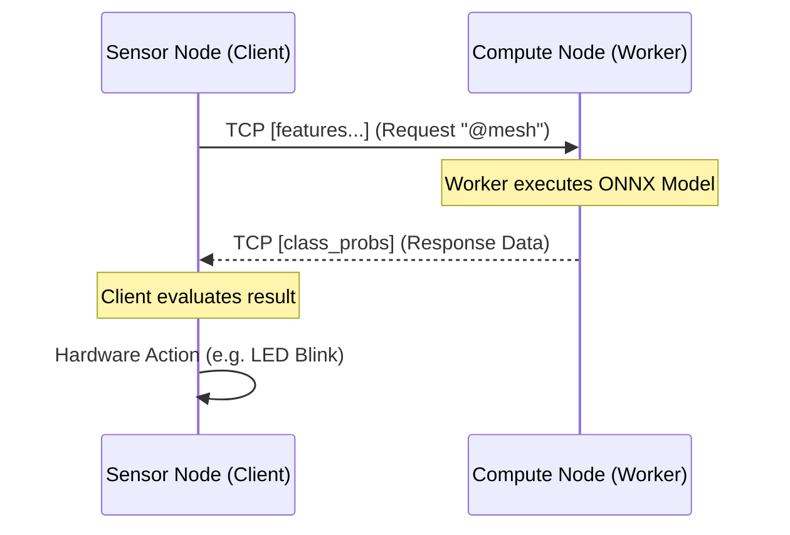

# Panduan Aplikasi Terdistribusi dengan `@mesh`

Selamat datang di era baru pengembangan _Distributed System_ IoT dan AI. OmniLang memiliki sistem Remote Procedure Call (RPC) tingkat bahasa untuk menyambungkan _node_ secara nirkabel dengan satu baris sintaks tanpa menabrak _firewall_ kompleks.

Berikut adalah arsitektur yang Anda butuhkan untuk mendirikan komunikasi _Client-Worker-Actuator_.

---

## 🏛️ Arsitektur Sistem

Dalam OmniLang Mesh, node dibagi menjadi dua peran (Role) sementara:
1. **Mesh Worker (Pelayan)**: Suatu instansi OS/skrip yang _mendengar_ pada port jaringan, siap menjalankan fungsi apapun yang diminta dan memulangkan responsnya.
2. **Mesh Client (Pemohon)**: Skrip sensor/logika yang ketika memanggil sebuah fungsi dalam source code, justru memicu _RPC call_ ke udara untuk dieksekusi oleh Worker.



---

## 💻 Contoh Implementasi

Anda dapat memutar simulasi pada contoh bawaan `examples/mesh_oracle.omni`.

### 1. Mesin AI (Worker Node)
Mesin yang kuat (atau memiliki GPU) dapat dijalankan sebagai pelayan Mesh menggunakan satu langkah CLI:
```bash
$ omnilang serve examples/mesh_oracle.omni --port 8081
```
Ini akan membacakan semua fungsi dalam _module_ skrip, dan mem-blok (menahan) terminal untuk memutar _server event-loop_.

### 2. Mesin Sensor (Client Node)
Anotasi sintaks ini ditaruh pada berkas di _Client_:
```omnilang
@mesh(target: "127.0.0.1:8081")
fn detect_objects(image_data: [f64]) -> [[f64]];
```

Apabila skrip yang sama dieksekusi dengan *command* tes biasa:
```bash
$ omnilang test examples/mesh_oracle.omni
```
Perjalanan kode yang melibatkan `detect_objects(..)` akan secara transparan diserialisasi kedalam _JSON_ internal ringan dan mendarat pada mesin dengan IP target.

---

## 🔐 Keamanan Target
Sistem saat ini menyokong topologi port mandiri (*Static Discovery Binding*), yang ideal untuk lingkungan Edge internal dan VPC tertutup. Perbaikan rute dan verifikasi kriptografi _X-Capability_ direncanakan untuk _Milestone_ pertengahan.
