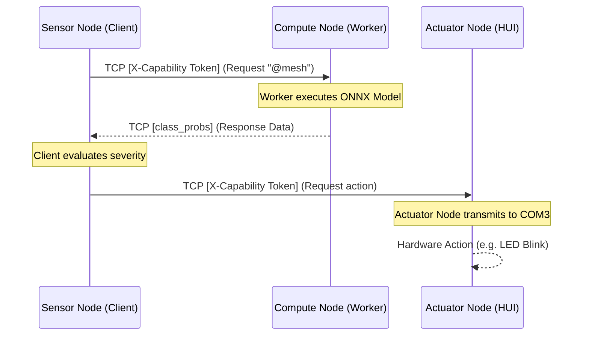

# Panduan Aplikasi Terdistribusi dengan `@mesh`

Selamat datang di era baru pengembangan _Distributed System_ IoT dan AI. OmniLang memiliki sistem Remote Procedure Call (RPC) tingkat bahasa untuk menyambungkan _node_ secara nirkabel dengan satu baris sintaks tanpa menabrak _firewall_ kompleks.

Berikut adalah arsitektur yang Anda butuhkan untuk mendirikan komunikasi _Client-Worker-Actuator_.

---

## 🏛️ Arsitektur Sistem

Dalam OmniLang Mesh, node dibagi menjadi tiga peran fungsional dalam OODA Loop:
1. **Mesh Worker (Pelayan Compute/AI)**: Suatu instansi OS/skrip yang _mendengar_ pada port jaringan, siap mengeksekusi beban komputasi besar (seperti ONNX model) lalu memulangkan jawabannya.
2. **Mesh Client (Sensor Pertama/Pemohon)**: Skrip sensor/logika yang ketika memanggil sebuah fungsi dalam source code, justru memicu _RPC call_ ke udara untuk dieksekusi oleh Worker.
3. **Mesh Actuator (Perangkat Keras)**: Modul HUI (Hardware User Interface) yang _mendengar_ pada port, lalu menerjemahkan paket RPC menjadi instruksi _Serial/UART_ bagi motor atau LED di mikrokontroler.


```mermaid
sequenceDiagram
    participant S as Sensor Node (Client)
    participant W as Compute Node (Worker)
    participant A as Actuator Node (HUI)
    
    S->>W: TCP [X-Capability Token] (Request "@mesh")
    Note over W: Worker executes ONNX Model
    W-->>S: TCP [class_probs] (Response Data)
    Note over S: Client evaluates severity
    S->>A: TCP [X-Capability Token] (Request action)
    Note over A: Actuator Node transmits to COM3
    A-->>A: Hardware Action (e.g. LED Blink)
```

---

## 💻 Contoh Implementasi

Anda dapat memutar simulasi pada contoh bawaan `examples/mesh_oracle.omni`.

### 1. Mesin AI (Worker Node)
Mesin yang kuat (atau memiliki GPU) dapat dijalankan sebagai pelayan Mesh menggunakan satu langkah CLI:
```bash
$ omnilang serve examples/mesh_oracle.omni --port 8081
```
Ini akan membacakan semua fungsi dalam _module_ skrip, dan mem-blok (menahan) terminal untuk memutar _server event-loop_.

### 2. Mesin Aktuator (Hardware Node)
Jalankan daemon kedua yang disambungkan langsung ke perangkat mikrokontroler menggunakan parameter `--hui` port. Terminal akan otomatis mengenkapsulasi transmisi Serial COM:
```bash
$ omnilang serve examples/ooda_loop/actuator.omni --port 8082 --hui COM3
```

### 3. Mesin Sensor (Client Node)
Anotasi sintaks ini ditaruh pada berkas di _Client_:
```omnilang
@mesh(target: "127.0.0.1:8081")
fn detect_objects(feature_data: [f64]) -> [[f64]];

@mesh(target: "127.0.0.1:8082")
fn trigger_alarm(severity: i32) -> bool;
```

Apabila skrip yang sama dieksekusi dengan *command* tes biasa:
```bash
$ omnilang test examples/mesh_oracle.omni
```
Perjalanan kode yang melibatkan `detect_objects(..)` akan secara transparan diserialisasi kedalam _JSON_ internal ringan dan mendarat pada mesin dengan IP target.

---

## 🔐 Keamanan Target (X-Capability Token)
Sistem topologi port mandiri (*Static Discovery Binding*) OmniLang Mesh kini dilapisi kapabilitas **Zero-Trust**. Setiap lompatan transmisi *Mesh Request* (dari Sensor ke Oracle, maupun ke Aktuator) diautentikasi dengan verifikasi kriptografis token di lapis bawah kompilator. 

Tanpa _global constraint_ konstan `X_CAPABILITY_TOKEN`, paket AST OmniLang akan ditolak secara mutlak (`Security Halt`) sebelum sempat mengakses kapabilitas HUI Hardware atau siklus CPU *Worker*.
