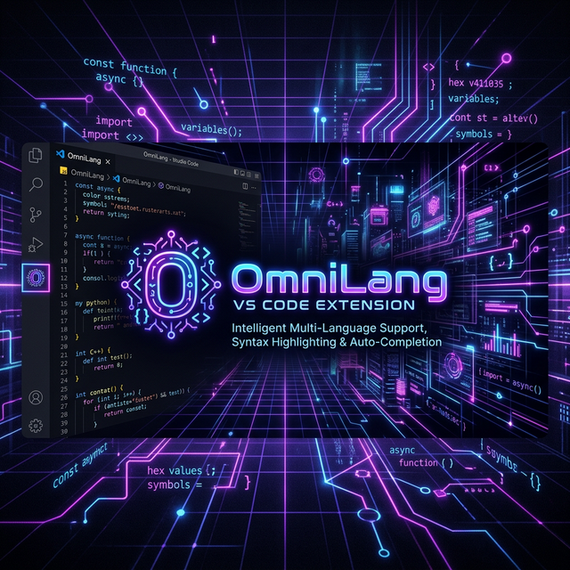
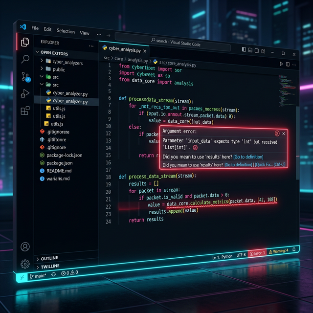

# 🌌 OmniLang untuk Visual Studio Code

**Infrastruktur Pemrograman Berkinerja Tinggi & Orkestrasi AI Terdistribusi**

---

## 📖 Penjelasan Singkat

Selamat datang di antarmuka resmi **OmniLang**! Ekstensi ini adalah jembatan *Developer Experience* (DX) yang menghubungkan editor Visual Studio Code Anda dengan mesin kompilator Native OmniLang.

Ditenagai oleh perpaduan arsitektur asinkron *under-the-hood* (`tokio`) serta *Language Server Protocol* (`tower-lsp`), ekstensi ini mengamati, menganalisis, dan melindungi setiap baris kode Anda agar terbebas dari kesalahan tipe data maupun sintaks (*Zero Syntax Error Policy*). Sangat cocok untuk pengembangan Sistem Operasi, Orkestrasi AI Terdistribusi, maupun IoT tingkat militer yang disajikan secara sederhana bagi pemula.

---

## 🔎 About (Tentang Ekstensi)

Ekstensi OmniLang dirancang dengan prinsip **Ultra-Low Memory** dan **Kecepatan Real-Time**. Fitur andalan bawaannya meliputi:

* **🎯 Diagnostik Real-Time (*Red Squiggly Lines*)**: Menguji keabsahan tipe dan logika kode saat Anda mengetik, bahkan **sebelum** Anda menyimpan file.
  
  

* **🖱️ Hover Analytics**: Menampilkan informasi cerdas tentang entitas *Token* OmniLang saat Anda mengarahkan kursor/mouse ke atas kode.

  

* **🔌 Deteksi Otomatis Extension `.omni`**: Mendaftarkan tipe identitas bahasa `hakato99.omnilang` ke dalam IDE secara purna.

_Penting: Ekstensi ini merupakan *Frontend* (Klien). Pastikan *Backend* Kompilator OmniLang (`omnilang.exe` atau `omnilang`) sudah terpasang di komputer Anda dan dapat diakses dari Environment Variables (`PATH`)._

---

## 🌐 Platform Support (Dukungan Sistem)

Ekstensi ini murni berjalan di lingkungan VS Code *Extension Host* yang netral. Platform yang sepenuhnya divalidasi dan didukung meliputi:

* **Windows (x64 / ARM64)** (Optimalisasi Penuh)
* **Linux (Ubuntu / Fedora / Arch)** (Kepatuhan Native)
* **macOS (Intel / Apple Silicon M1/M2/M3)** (Dukungan Universal)

Dengan memastikan kompiler OmniLang yang cocok berada di sistem yang bersangkutan.

---

## 🤝 Getting Help (Bantuan Teknis)

Jika linting berhenti bekerja, atau LSP *Server* mengalami gangguan:
1. Pastikan ekstensi file Anda sudah `.omni`.
2. Buka terminal standar, jalankan `omnilang --version`. Jika _command not found_, perbaiki `PATH` instalasi Anda.
3. Kunjungi Repositori Utama Kami untuk mempelajari contoh arsitekturnya.
4. Periksa folder `docs/WALKTHROUGH.md` dari instalasi repo OmniLang untuk logika dasar bahasa.

---

## 📜 Code of Conduct

Tim HaKaTo99 mengadopsi _Contributor Covenant_. Dengan mengunduh dan memanfaatkan ekosistem pertukaran paket (`opm`) OmniLang dan ekstensi ini, seluruh kolaborator sepakat untuk:
- Mempertahankan etos kerja kode yang stabil dan bebas _Crash_ (*Military Grade Stability*).
- Menjaga ranah publik (*Community Hub*) dan iterasi isu GitHub dengan empati, kolaborasi, dan diskursus teknis tanpa unsur perpecahan. 

---

## 👨‍💻 Maintainers

Dikembangkan, dirancang, dan diarsiteki oleh:
**HaKaTo99** – _Lead Core OS & Language System Architect_.

---

## 🏗️ Berkontribusi (Contribution)

Kami mengundang talenta global untuk menyempurnakan OmniLang!
Jika Anda menemukan _bug_ atau sekadar ingin menyumbang algoritme baru:
1. Akses Repositori Utama GitHub `HaKaTo99/OmniLang`.
2. Baca pedoman kontribusi pada file `CONTRIBUTING.md`.
3. Gunakan _Pull Requests_ untuk integrasi fitur baru ke pelayan LSP, *Syntax Highlighter*, maupun standar CLI.
4. Pertahankan budaya "Nol Peringatan Bawaan" (*Zero Warning Policy*) pada Rust Compiler (`cargo check`). 

---

## 📦 Release Note (Catatan Rilis)

### **v2.4.0 (Rilis Terkini)**
* **Implementasi LSP Baru:** Menggantikan parser kustom menjadi implementasi *Language Server Protocol* asinkron standar (`tower-lsp`).
* **Hover Insights MVP:** Dukungan analitik pengidentifikasian informasi lintas token.
* **Virtual Document Synchronizer:** Analisis diagnostik kini membaca memcache VS Code secara `did_change` (*Live Check*). 

---

## ⚖️ License (Lisensi)

Hak Cipta © 2026 **HaKaTo99**.
Perangkat lunak ini (bersama dengan seluruh perkakas rantai kompilasinya) didistribusikan di bawah naungan **MIT License**. Anda bebas menggunakan, memodifikasi, dan mendistribusikannya baik dalam urusan pendidikan (edukasi pemula) maupun produk industri komersial mutakhir.
